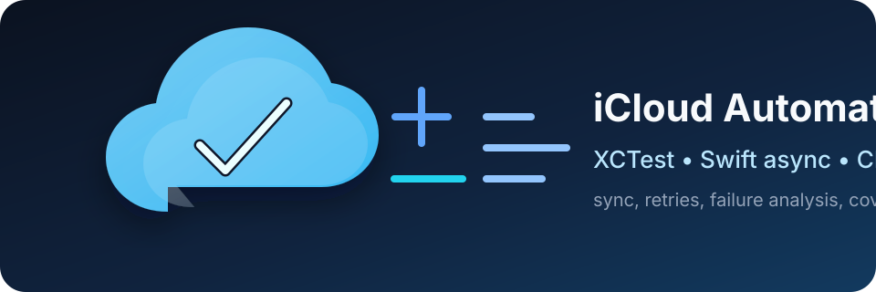
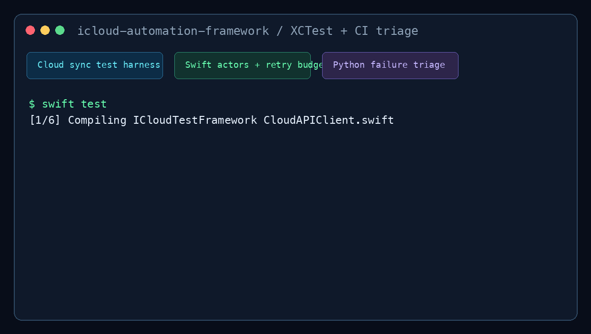

# icloud-automation-framework



XCTest-based automation framework for iCloud-style services across iOS, macOS,
and Web. Covers sync operations, conflict resolution, failover scenarios, and
CI failure triage with Swift and Python tooling.



Related: [xctriage](https://github.com/gerardrecinto/xctriage) (Swift 6 CI failure
analysis tool using actor isolation + `xcresulttool`), [ci-triage](https://github.com/gerardrecinto/ci-triage)
(Python CI failure triage with rule-based parsing and CI reporting).

---

## What's Here

| Path | Purpose | Signal |
|---|---|---|
| `Sources/ICloudTestFramework/CloudTestBase.swift` | XCTest base class: retry, timeout budget, stability enforcement | Test reliability |
| `Sources/ICloudTestFramework/FailureAnalyzer.swift` | Swift actor for concurrent failure categorization | Async-safe triage |
| `Sources/ICloudTestFramework/CloudAPIClient.swift` | Mock cloud API client: sync, fetch, delete, batch | Integration-test harness |
| `Sources/ICloudTestFramework/CloudFaultInjection.swift` | Deterministic fault scenarios: latency, 5xx/429, offline, partial batch failure | Chaos/failure-mode test coverage |
| `Tests/ICloudTests/CloudSyncTests.swift` | XCTest suite across sync lifecycle | Regression coverage |
| `Tests/ICloudTests/CloudFaultInjectionTests.swift` | XCTest suite for fault scenarios (retry, offline, 429, partial batch) | Failure-mode regression coverage |
| `Tests/ICloudTests/FailureAnalyzerTests.swift` | Unit tests for triage categorization | Maintained signal quality |
| `scripts/triage.py` | Python parser for `.xcresult` bundles and xcodebuild logs | CI failure reporting |
| `scripts/coverage_gap.py` | Python scanner for untested public symbols | Coverage gap detection |
| `Jenkinsfile` | Build, test, triage, and publish flow | CI/CD automation |

---

## Quick Start

```bash
# Build + test (requires macOS, Xcode 15+, Swift 5.9+)
swift build
swift test

# Triage a .xcresult bundle
python3 scripts/triage.py xcresult path/to/Results.xcresult -v

# Triage a plain xcodebuild log
python3 scripts/triage.py log build/xcodebuild.log

# Categorize a single failure message
python3 scripts/triage.py categorize "XCTAssertEqual failed: expected 200 got 404"

# Check test coverage gaps
python3 scripts/coverage_gap.py \
    --source Sources/ \
    --tests Tests/ \
    --min-coverage 80 \
    --show-gaps
```

---

## Framework Architecture

```
CloudTestBase (XCTestCase)
├── withRetry<T>(): exponential backoff, retryable vs non-retryable errors
├── assertCloudOperation(): budget assertion + status assertion in one call
└── setUp/tearDown: connect/disconnect + slow-test budget check

CloudAPIClient (actor)
├── syncDocument(): PUT with conflict detection
├── fetchDocuments(): paginated GET
├── deleteDocument(): DELETE with 404 handling
└── mockMode: in-process stubs, no network required for CI

FailureAnalyzer (actor)
├── categorize(): infrastructure / product / environment / flaky
├── record(): concurrent-safe failure recording
├── flakyOperations(): ops that failed on attempt > 1
└── summary(): FailureSummary for CI reporting

scripts/triage.py
├── parse_xcresult(): xcresulttool JSON extraction
├── parse_log_file(): plain-text xcodebuild log parser
├── TRIAGE_RULES[]: 11 ordered regex rules (infrastructure → product → flaky)
└── build_report(): signal ratio, actionable vs noise separation
```

---

## Failure Triage Logic

The triage engine separates CI signal from noise before paging engineers:

| Category | Meaning | Action |
|---|---|---|
| `product` | Wrong data, assertion fail, 404 | File bug, block merge |
| `environment` | Auth failure, fixture setup fail | Fix CI config, re-run |
| `infrastructure` | Timeout, DNS, 5xx | Retry; page infra if persistent |
| `flaky` | Fails intermittently (attempt > 1) | Tune retry budget |

Signal ratio = actionable / total. Ratio below 50% = infra problem, not product bug.

---

## Fault Injection

`CloudFaultScenario` reproduces realistic cloud-sync failure conditions
deterministically — no `sleep()`, no timing races. It's a value type you
chain, then install onto a `CloudAPIClient`:

```swift
let scenario = CloudFaultScenario()
    .failNext(.rateLimited(retryAfter: .seconds(1)), times: 2)
    .thenSucceed()

await apiClient.install(scenario)

// existing CloudTestBase.withRetry drives the retries; the scenario
// throws CloudAPIError.rateLimited twice, then succeeds on attempt 3
let result = try await withRetry(operation: "sync") {
    try await apiClient.syncDocument(id: "doc-1", payload: ["title": "hi"])
}
```

Also covers offline periods (`client.goOffline()` / `client.recover()`),
injected latency through an installable clock (`client.install(clock:)`,
swap in `ManualFaultClock` in tests so injected delays never cost real
wall-clock time), and partial-batch failures via `syncBatch(_:)` +
`.failingBatchItems(_:with:)`. Every injected failure is still a plain
`CloudAPIError`, so `FailureAnalyzer` categorizes and reports on it the
same as a real failure — no separate diagnostic path.

---

## Requirements

```
macOS 14+
Xcode 15+ (Swift 5.9+)
Python 3.9+ (for scripts/)
```
